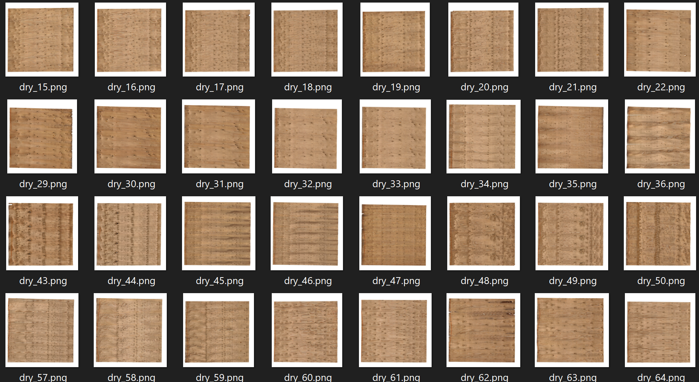

  

# Classifying Wood Veneers as Dry or Wet

This dataset1 comprises images depicting *dry* and *wet* wood veneers. The data could be used to build and train an ML model that can detect defects in wood veneers during manufacturing.

# Structure

This repo contains the following structure:

- **smaller_veneer_log.csv**: CSV file for use in loading the data into PerceptiLabs. This file maps each image to a classification number (0 for dry and 1 for wet).

The following shows a partial example of the data stored in **data.csv** that is used to load the data into PerceptiLabs. The values in the **images** column indicate the respective classification depicted in each image.

| **images** | **labels** |
|------------|--------------|
| Dry/dry_1001.png | 0 |
| Wet/wet_1101.png | 1 |

The following shows example images from the dataset representing dry veneers:

  

Due to the amount of data, you must download the image files from the [original data source](https://ieee-dataport.org/open-access/veneer21).

# Community

Got questions, feedback, or want to join a community of machine learning practitioners working with exciting tools and projects? Check out our [Community](https://forum.perceptilabs.com/)!

1 Dataset Credits: https://ieee-dataport.org/open-access/veneer21. T. Jalonen, F. Laakom, M. Gabbouj and T. Puoskari, "Visual Product Tracking System Using Siamese Neural Networks," in IEEE Access, vol. 9, pp. 76796-76805, 2021, doi: 10.1109/ACCESS.2021.3082934.
